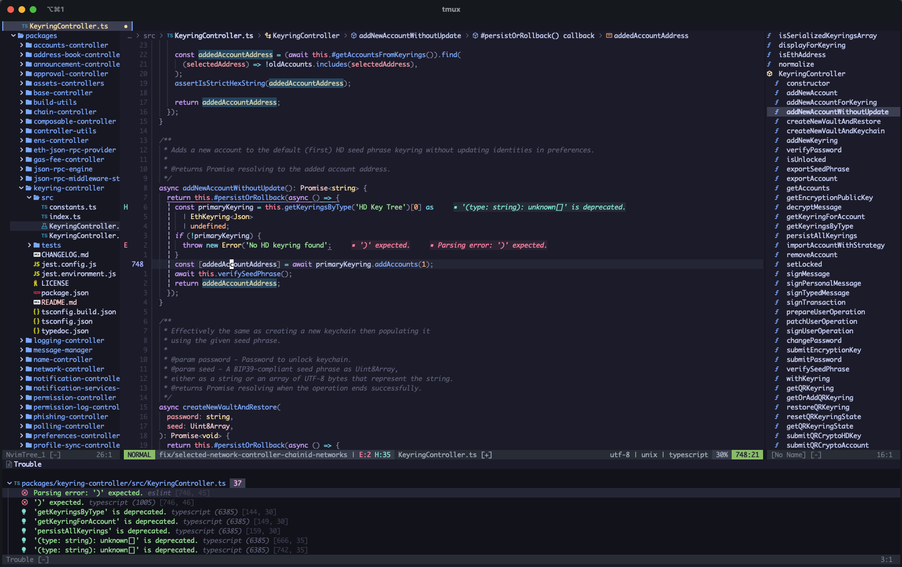

# nvim 

My personal Neovim configuration files.



## Quickstart

### Prerequisites

- [Neovim](https://neovim.io/)
- [Lazygit](https://github.com/jesseduffield/lazygit) - The only graphical git interface you'll ever need
- [Ripgrep](https://github.com/BurntSushi/ripgrep?tab=readme-ov-file#installation) - For fast search
- [gh](https://cli.github.com/) - For nice GitHub integrations (e.g. PR list, issue list, reviews, etc)
- (Optional) [Fzf](https://github.com/junegunn/fzf?tab=readme-ov-file#installation) - For ludicrous fast fuzzy search

### Installation

1. Backup your current nvim configuration files

```bash
mv ~/.config/nvim ~/.config/nvim.bak
```

2. Clone this repository

```bash
git clone https://github.com/mikesposito/nvim ~/.config/nvim
```

3. Open nvim and wait for the plugins to be installed

```bash
nvim
```

## Configuration 

### Preferences

The default editor preferences can be found here:
- `lua/custom/preferences.lua`: General editor preferences
- `lua/custom/keymaps.lua`: Key bindings 

You can add any custom configuration in the `lua/custom` folder, so you can keep pulling updates from this repository without conflicts.

## What's included? 

WIP: List to be completed
 
### Default keymaps 

#### Code navigation 

| Key | Action |
|-----|--------|
| `gd` | Goto definition      |
| `gr` | Goto references      |
| `gi` | Goto implementation  |
| `gD` | Goto type definition |

#### Code documentation 

| Key | Action |
|-----|--------|
| `Ds` | Document signature   |
| `Dy` | Document symbols     |
| `gD` | Document hover       |


#### Code actions shortcuts 

| Key | Action |
|-----|--------|
| `<space>ca` | Show available code actions  |
| `<space>cr` | Rename code                  |
| `<space>cs` | Swap code                    |

#### Debug 

| Key | Action |
|-----|--------|
| `<space>dt` | Toggle Debug UI              |
| `<space>do` | Open diagnostic              |
| `<space>dl` | Diagnostic list              |
| `<space>d[` | Next diagnostic message      |
| `<space>d]` | Previous diagnostic message  |
| `<space>dc` | Start/Continue Debug         |
| `<space>db` | Toggle bearkpoint            |
| `<space>dsi` | Step into                   |
| `<space>dso` | Step over                   |
| `<space>dsO` | Step out                    |

#### Editor window

| Key | Action |
|-----|--------|
| `<space>e` | Toggle file explorer column |

#### Git 

| Key | Action |
|-----|--------|
| `<space>gp` | Git pull |
| `<space>gP` | Git push |
| `<space>gg` | Open lazygit |
| `<space>gd` | Show diff since index |
| `<space>gD` | Show diff since last commit |
| `<space>ghs` | Stage hunk |
| `<space>ghr` | Reset hunk |
| `<space>ghS` | Stage buffer |
| `<space>ghR` | Reset buffer |
| `<space>ghu` | Undo stage |
| `<space>ghp` | Preview hunk |
| `<space>ghb` | Show line blame |
| `<space>gtb` | Toggle blame |
| `<space>gtd` | Toggle show deleted |

